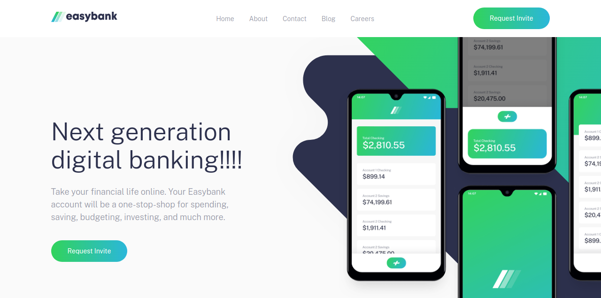
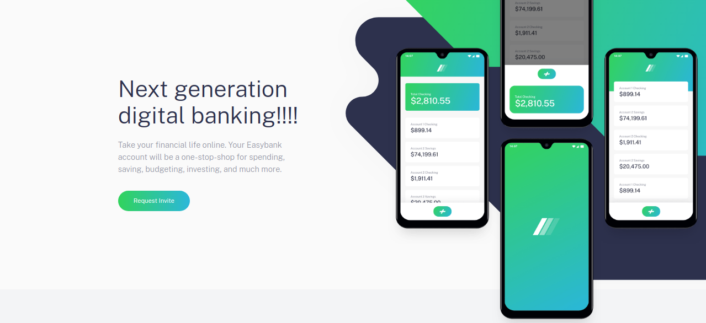
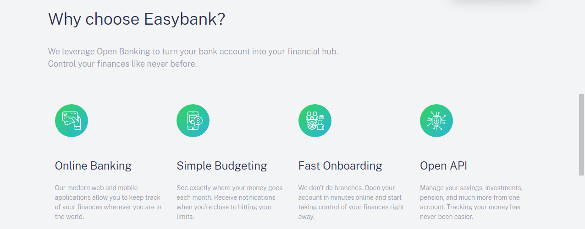

# EasyBank

## Welcome! 👋
[EasyBank](https://harsh2432.github.io/EasyBank/) project is a banking website 🏦

## Technology Used 💻
This website is build using HTML, CSS, SCSS and JavaScript!!

## Project Structure 🏗️
The website consists of five sections:
1. Header Section
   

2. Hero Section
   

3. Features Section
   

4. Articles Section
   

5. Footer Section
   